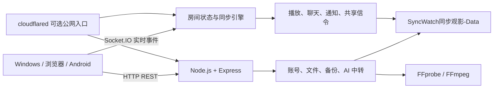

# SyncWatch同步观影

和朋友、家人、情侣远程一起看电影。

SyncWatch 是一个开源、自托管的 Watch Party / 同步观影系统。一个人启动服务器，其他人通过 Windows、Android 或浏览器加入房间，即可同步播放、暂停、拖动进度和倍速，同时支持聊天、弹幕、语音、屏幕共享和媒体管理。

你的服务器、你的影片、你的数据。无需依赖第三方同步观影平台。

[](https://github.com/xuange6610/SyncWatch/releases)
[](https://github.com/xuange6610/SyncWatch/stargazers)
[](https://github.com/xuange6610/SyncWatch/network/members)
[](LICENSE)
[](https://github.com/xuange6610/SyncWatch/actions/workflows/pages.yml)
[](https://github.com/xuange6610/SyncWatch/releases)
[](https://github.com/xuange6610/SyncWatch)


Windows · Android · Web  ·  同步播放 · 弹幕 · 聊天 · 语音 · 屏幕共享

[立即下载](https://github.com/xuange6610/SyncWatch/releases/latest) · [在线预览](https://xuange6610.github.io/SyncWatch/) · [新手快速开始](https://xuange6610.github.io/SyncWatch/quick-start.html) · [部署教程](docs/server-deployment-guide.md) · [GitHub Wiki](https://github.com/xuange6610/SyncWatch/wiki)

> 当前状态：v2.3.8 已完成源码回归并进入最终 Windows/Android 构建，发布前保持 pending；本版本只提供 Windows、Android 和 Windows 上需要的辅助工具。许可证：[Apache-2.0](LICENSE) · 作者：xuan

当前正式发布：[v2.3.4](https://github.com/xuange6610/SyncWatch/releases/tag/v2.3.4)；v2.3.8 已完成源码回归，待 GitHub 远端资产验收后再切换 Latest；[v2.3.8 发布说明](docs/release-notes-v2.3.8.md)记录本轮修复范围。

本版本的目标交付清单是 8 个维护者资产，加两个 GitHub 自动生成的源码归档，共 10 个文件（均为可见文件）；发布前必须完成 Release API、Latest 和下载回读核验。

> v2.3.0 纠正更新范围：更低延迟的画面/音频共享、原生分辨率与设备最高刷新率默认请求、房间实时音源标题和进程状态、停止共享后的即时清理、主题同步接受/拒绝/已应用回执，以及桌面启动等待窗口和本机页面加载重试。原子切换完成前，线上旧资产仍保持可下载；切换完成后只删除被替换的 v2.3.0 旧 8 项，历史版本不受影响。

## 在线参观

打开 [SyncWatch同步观影在线体验入口](https://xuange6610.github.io/SyncWatch/) 可以查看真实登录界面、同步播放画面、管理中心功能导览、数据目录说明、下载入口和新手快速开始；点击页面顶部的“GitHub主页”可以回到源代码仓库。

在线入口已经放在本 README 的“在线参观”小节、仓库右侧 About 的 Homepage 字段，以及展示站顶部导航和首屏按钮中：

- [打开在线体验 / 功能展示](https://xuange6610.github.io/SyncWatch/)
- [打开 GitHub 主页](https://github.com/xuange6610/SyncWatch)


> GitHub Pages 只能托管静态网页。在线入口可以真实展示界面、截图、操作流程和下载说明，但不能在 GitHub 的静态主机上运行 Node.js、WebSocket、文件上传、AI 中转或临时公网访问，也不保存账号和媒体。要实际创建房间、上传影片和邀请成员，请下载服务器版或按照部署教程启动自己的实例。

## 新手应该下载哪个文件

不准备修改代码的用户，请打开 [GitHub Releases](https://github.com/xuange6610/SyncWatch/releases/latest)。不要把仓库首页的 `Source code (zip)` 当成完整安装包。

| 下载文件 | 运行角色 | 适合谁 | 作用 |
| --- | --- | --- | --- |
| [`SyncWatch-Experience-Client-Portable-v2.3.8-x64.exe`](https://github.com/xuange6610/SyncWatch/releases/download/v2.3.8/SyncWatch-Experience-Client-Portable-v2.3.8-x64.exe) | **客户端** | 体验版；普通成员 | 输入已有服务器地址加入房间，不启动服务端 |
| [`SyncWatch-v2.3.8-Full-Offline-Portable-x64.exe`](https://github.com/xuange6610/SyncWatch/releases/download/v2.3.8/SyncWatch-v2.3.8-Full-Offline-Portable-x64.exe) | **服务器** | 完整便携版；房主 | 无需安装，下载后直接双击开房 |
| [`cloudflared-windows-x64-installer.msi`](https://github.com/xuange6610/SyncWatch/releases/download/v2.3.8/cloudflared-windows-x64-installer.msi) / [`cloudflared-windows-x86-installer.msi`](https://github.com/xuange6610/SyncWatch/releases/download/v2.3.8/cloudflared-windows-x86-installer.msi) | **服务器工具** | 公网访问工具 | 双击 MSI 安装；安装后在终端执行 `cloudflared --version`，再按教程创建 Tunnel；[Cloudflare 官网](https://developers.cloudflare.com/cloudflare-one/connections/connect-networks/) · [官方 Release 下载](https://github.com/cloudflare/cloudflared/releases/latest) |
| [`node-v24.19.0-x64.msi`](https://github.com/xuange6610/SyncWatch/releases/download/v2.3.8/node-v24.19.0-x64.msi) / [`node-v24.19.0-arm64.msi`](https://github.com/xuange6610/SyncWatch/releases/download/v2.3.8/node-v24.19.0-arm64.msi) | **服务器环境** | 源码/独立服务器环境 | 正式 SyncWatch EXE 无需另装；源码和独立服务端安装后运行 `node --version` 验证；[Node.js 官网](https://nodejs.org/) · [官方下载](https://nodejs.org/en/download) |
| [`SyncWatch-Android-v2.3.8-universal.apk`](https://github.com/xuange6610/SyncWatch/releases/download/v2.3.8/SyncWatch-Android-v2.3.8-universal.apk) | **客户端** | Android 用户 | 加入已有房间；完整包可在受支持设备上运行手机服务器 |
| [独立服务器部署教程](docs/server-deployment-guide.md) | Windows/Linux 服务器管理员 | 固定 10 项 Release 不包含额外服务器 ZIP；从源码使用 Node.js 启动，适合长期部署和 Docker |
| Source code：[ZIP](https://github.com/xuange6610/SyncWatch/archive/refs/tags/v2.3.8.zip) / [TAR.GZ](https://github.com/xuange6610/SyncWatch/archive/refs/tags/v2.3.8.tar.gz) | 开发者 | 只用于阅读、修改和自行构建，不是可双击安装包 |

## 第一次启动服务器

### 使用服务器 EXE

1. 从 Releases 下载 `SyncWatch-v2.3.8-Full-Offline-Portable-x64.exe`，双击即可开房。
2. 安装版按向导选择目录并启动；独立完整版和标准版放进普通文件夹后双击。Windows 防火墙询问时，只按你的实际网络环境允许访问。
3. 浏览器会打开 `http://127.0.0.1:20311`；如果端口被占用，程序会明确提示占用端口并停止启动，不会随机改端口。关闭占用程序，或在“系统 → 服务器启动设置”中改用其他端口后重试。
4. 使用默认管理员账号 `admin`、密码 `admin888` 登录。
5. 立即进入安全设置修改管理员密码。只有内置 `admin` 本次会话刚用账号密码认证且仍处于首次初始化时，服务端才允许直接填写新密码和确认密码；成功后该能力立即失效。被授予超级管理员的普通账号不再强制改密，本机免密管理会话和普通周期改密也不会绕过校验。
6. 创建房间，可以设置房间密码、人数限制和成员权限。
7. 先让同一 Wi-Fi 下的成员使用局域网地址连接，确认成功后再配置公网访问。

注册账号和普通登录密码默认不限制字符类型或字符数；服务端只保留用户名 1024 UTF-8 字节、密码 4096 UTF-8 字节的异常请求防护上限。管理员可在“服务器设置 → 账号与密码规则”显式启用字符集或字符数范围，保存后新注册、改密和找回密码流程都会使用同一策略。

> 服务器设备可使用“本机免密进入管理中心”或“本机免密以 admin 进入所选房间”。两条入口只在回环同源且持有服务器主机令牌时显示，不能从公网伪造；可在“管理中心 → 服务器设置 → 本机免密入口”分别关闭。管理专用会话可点击“退出管理登录”完整撤销，普通成员和普通账号仍按房间登录流程进入观影。

Windows 服务器默认在全部本机网卡上监听 `20311` 端口，并自动把首选物理网卡用于局域网分享。如果电脑同时连着有线、Wi-Fi、VPN 或 TUN，可在左上角“系统 → 服务器启动设置”选择指定网卡；保存后服务器会自动安全重启。未选择时会自动跟随当前可用物理网卡，手动选择的网卡断开后也会回退到自动模式。系统防火墙是操作系统权限：首次启动出现 Windows 提示时仍需按实际网络允许访问。

### 从源码启动

需要 Git 和 Node.js 22 或更高版本，推荐 Node.js 24 LTS。

```bash
git clone https://github.com/xuange6610/SyncWatch.git
cd SyncWatch
npm ci
npm start
```

只启动独立服务端：

```bash
npm run start:server
```

默认地址是 `http://127.0.0.1:20311`。如果你使用 pnpm：

```bash
corepack enable
pnpm install --frozen-lockfile
pnpm start
```

## 让其他人加入房间

### 同一个 Wi-Fi / 局域网

1. 房主保持服务器运行，不要关闭服务器窗口。
2. 在软件中分享显示的内网地址，例如 `http://192.0.2.10:20311`。
3. 成员在客户端中填写地址，或直接用浏览器打开。
4. 成员登录或按服务器规则注册，再选择房间。
5. 房主选择影片并开始播放，成员端会跟随共同播放状态。

示例地址使用文档保留网段，实际地址以软件显示为准。

### 跨网络连接

1. 在“服务器设置 > 公网访问”中选择临时公网访问，或配置自己的域名和 HTTPS 反向代理。
2. 源码/独立服务端第一次需要 cloudflared 时，会从 Cloudflare 官方 GitHub Release 下载与系统匹配的文件并校验 SHA-256；安装完整版和便携标准版优先使用内置文件。
3. 等待界面显示 HTTPS 地址并通过连接诊断。
4. 只把成员链接发给可信成员，不公开带房主权限的链接、令牌或管理密码。
5. 临时地址可能在重启后变化；需要固定域名时请阅读服务器部署教程。

如果出现“Cloudflare 临时地址接口连接超时”，新版会在物理直连不可用或新地址无法验证时自动切换连接策略；仍失败时取消“绕过系统代理”并运行“网络诊断与修复”。Clash/FlClash/VPN/TUN Fake-IP 用户应让 `cloudflared.exe` 与 `*.trycloudflare.com`、`*.argotunnel.com` 使用同一条可用网络规则。独立安装、官方地址和 Node.js 教程见 [cloudflared 与 Node.js 安装使用教程](docs/runtime-installation.md)。

Cloudflare Tunnel 从本机回源时，服务器会信任回环地址和服务器自身网卡地址，并从 `X-Forwarded-For` 右侧开始剥离可信代理节点，因此不同公网客户端会保留各自的真实来源 IP，游客限额不会再全部落到同一个穿透 IP。Docker、Nginx 或 frp 运行在其他主机/容器网段时，须显式设置 `SYNCWATCH_TRUSTED_PROXIES`，或在 Node/Electron/独立包启动时传入 `--trusted-proxies=172.18.0.0/16,10.0.0.5`；命令行值优先于环境变量。只填实际受控的代理地址；`0.0.0.0/0` 和 `::/0` 会被当作无效配置 fail-closed 忽略。

新客户端默认使用“原画”；公网页面能打开但手机画面卡住时，可在播放器手动选择“流畅版”，并在“处理进度”确认它已真正生成。流畅版目标为 854×480、视频约 900 kbps、音频 96 kbps；本地缓冲不足时同步器会暂停反复定位，避免不断丢弃已下载片段。若仍卡顿，按[常见错误](docs/troubleshooting.md)检查服务器上行、手机实测下载、WebSocket/Polling 和媒体 Range。

若媒体请求进入 `waiting/stalled` 且 12 秒没有播放时间或缓冲增长，客户端会执行最多 5 次渐进退避恢复；设备或 Socket 离线时暂停消耗重试次数，连接恢复后继续当前影片，原画恢复仍失败且已有流畅版时再自动降级。超过 32 MiB 的媒体使用 8 MiB 有界开放 Range，减少高延迟公网链路频繁续段，同时避免拖动后遗留无限大响应阻塞控制通道。这能处理 Tunnel/TUN 半开和短时断网，但不能消除 Cloudflare 临时隧道、家庭上行或 VPN/TUN 本身的真实抖动。

顶栏网络状态与视频缓冲分开判断：前台每 4 秒最多进行一次 Socket.IO 控制通道探测，单次高延迟、视频 `waiting/stalled` 或成员短暂重连不会单独触发“网络波动”或直接改变当前状态；连续 3 次延迟超过 500 毫秒或超时才显示“网络波动”，连续 2 次健康样本后恢复。页面或 Android WebView 进入后台后不启动新探测，后台返回的旧 ACK 直接丢弃，回到前台后重置迟滞状态并立即重新测量。真正的本机连接断开仍显示“连接中断”。

## 主要功能

- **同步播放**：房主始终可以控制播放、暂停、进度和共享倍速；其他成员可由权限组授予控制权，快进/拖动可独立授权。跳过片头片尾设置也有独立的 `skipSettings` 权限，可在“成员与权限组”中授予指定成员或权限组。支持指定成员清晰度确认和队列批量添加/删除。
- **媒体与字幕**：上传影片、音频、字幕、图片和文档，也可添加合法的 HTTPS 媒体直链。
- **多房间**：支持正式房间、临时房间、房间密码、人数限制和房主/管理员权限；房主确认后可复制房间配置与媒体，内置 `admin` 可二次确认后覆盖迁移目标房间。
- **同步阅读**：TXT、Markdown、日志、CSV/TSV、JSON/XML/YAML 和常见配置文本可连续滚动或按页阅读；有控制权限的成员同步 `fileId`、精确 UTF-16 `characterOffset`、归一化位置、页码和 revision。桌面与手机可以因宽度不同显示不同视觉行首，但不会再把本地换行回写成房间锚点；晚加入或重连成员恢复同一逻辑字符和段落。管理员可在“房间与上传 → 上传限制”关闭文本上传。
- **登录与游客**：账号密码正确但房间号留空时，先列出该账号可用房间，也可选择临时房间；提醒可暂停或在安全设置中关闭。游客只获得普通成员权限，需注册后才能建立正式房间。手机顶栏账号入口会在覆盖式功能菜单内展开“退出登录，保留账号密码”和普通“退出登录”；前者退出后只把本次账号密码恢复到登录表单，二者都会清除登录会话。
- **注册申请与密码安全**：注册受限时可按所需账号数量提交申请，并按数量部分撤回或全部撤回；内置 `admin` 可在用户申请中心批量删除记录。管理端只显示密码是否已设置、待修改/过期状态和最近更新时间，不返回密码或哈希；“重置为默认密码”会撤销现有会话并要求用户按安全流程更换。
- **实时交流**：公聊、私聊、弹幕、表情、图片、语音消息和全麦语音；可按账号启用仅聊天、设置弹幕颜色/字号或切换简洁模式。全屏只保留弹幕和用户主动打开的边看边聊，不弹普通通知；按 `F2` 或回车可以直接打开聊天并输入，按 `L` 锁定或解锁画面操作。
- **共享能力**：浏览器、Electron 和 Android 屏幕共享；当前源码默认请求原生分辨率、设备最高刷新率、极致画质和系统音频，并优先使用 WebRTC，只有连接未建立或断开时才使用有界 JPEG/PCM 兜底。手机进入全屏后可选择竖屏、横屏或自动横屏；进入全屏保持当前设备方向，不再自动旋转，方向由控制层手动选择。Tunnel 兜底会按 ACK 延迟自适应画面尺寸、JPEG 质量与采集节奏，并只保留最新帧，降低公网卡顿；房间会显示共享者、音频标题与进程名。实际分辨率、帧率、音频捕获和端到端延迟仍由操作系统、浏览器、编码器、设备与网络共同决定。
- **网页同步观影**：房主输入任意 HTTP/HTTPS URL，打开目标网页后选择浏览器标签页或窗口，房间成员接收同一实时画面和声音。服务器保存 URL/revision 供晚加入恢复提示；DRM、系统保护窗口和录屏权限限制可能导致黑屏。兼容预览仅用于本机独立查看。
- **账号与管理**：好友、通知、在线状态、设备信息、权限组、封禁、注册审批和操作记录；登录限流可申请管理员清除，敏感设备定位状态只给内置 `admin`。成员头像单击打开资料，桌面双击或触摸端快速双击查看大图。
- **媒体处理**：FFprobe 分析媒体，FFmpeg 在上传完成后默认生成缩略图和约 480P、1 Mbps 的 H.264/AAC 低带宽流畅版；丢失的缩略图会自动补建。
- **AI 工作台**：可配置兼容 Responses API 或 Chat Completions 的对话、生图和视频接口。
- **运维能力**：数据导入导出、备份恢复、回收站、邮件验证、密码找回、日志和网络诊断。
- **帮助与管理入口**：页面顶栏“关于”集中显示产品、作者、许可证、项目主页和 Wiki；桌面服务器“帮助 → 运行信息”可直接复制或打开局域网地址与数据目录，“帮助”菜单也提供同一组官方入口。纯 Node.js 控制台没有 Electron 原生菜单，但会输出私密管理 URL、配置/数据路径和浏览器快捷键，`--help` 查看参数，`--open-browser` 可在就绪后打开等价管理页面。

### 常用开关在哪里

- 关闭登录选房提醒：进入房间后打开右上角账号菜单 → “安全设置” → 关闭“登录房间提醒”。登录弹窗也可选择 1 小时、1 天、1 周、30 天或永不再提醒。
- 关闭自动兼容转换：服务器管理员打开顶栏“处理进度” → 取消“上传完成后自动生成浏览器兼容版” → “立即应用”。关闭后新上传影片保留原文件，需要时仍可手动处理。
- 选择局域网网卡和公网根地址：Windows 服务器左上角“系统 → 服务器启动设置”。“公网根地址”填写已经配置好 DNS、HTTPS 证书和反向代理的完整根地址，例如 `https://watch.example.com`；不要填子路径、查询参数或单独主机名。该字段用于分享地址和代理信任校验，不会代替 DNS、证书或路由器配置。
- 只有真实服务器应用窗口显示当前开放的局域网 `IP:端口`。普通 Electron/Android/浏览器客户端不显示内网地址；公网分享只使用当前 HTTPS/Tunnel Origin 或服务器配置的公网根地址，没有可信公网地址时不会回退 LAN IP。
- 位置提醒开关位于“管理中心 → 通知/通告设置”。关闭“位置状态通知”后不再广播已授权位置状态；关闭“位置授权请求”后不再自动提示，也不允许管理员向成员发起授权请求。

## 原理与技术架构

SyncWatch同步观影采用“一个自托管服务器，多种客户端共用”的结构。服务器保存账号、房间、媒体和共同播放状态；Windows、Android 和浏览器只需要连接同一个地址。这样每个成员看到的是同一份房间状态，而媒体和隐私数据仍留在房主自己的设备中。



一次完整操作的实现过程是：

1. Electron、独立 Node.js 服务或 Android 前台服务启动 `server/index.js`，创建 Express HTTP 服务和 Socket.IO 实时通道。
2. 客户端先通过同源页面加载界面，再建立 Socket.IO 连接；登录后服务端校验密码哈希、设备策略、协议版本、房间密码和权限。
3. 房主点击播放、暂停、跳转或倍速时，客户端只发送操作意图；服务端更新权威房间状态，附上时间和版本，再向房间成员广播。倍速控制始终对房主开放。
4. 成员端根据服务器时间、网络延迟和本地缓冲计算偏差，超过阈值才校正播放器；正在缓冲时暂停硬跳转，避免网络抖动造成反复定位。
5. 上传使用 HTTP 流式写入，FFprobe 读取编码与时长；分辨率或平均码率超过流畅版预算时也会由 FFmpeg 生成低带宽 H.264/AAC 版本。媒体本体通过 HTTP Range 分段读取，播放状态仍通过 Socket.IO 同步。
6. 配置和业务记录写入 `SyncWatch同步观影-Data/`，敏感材料单独保存在 secrets 目录；写盘使用临时文件与原子替换，同一数据目录只允许一个实例写入。
7. 开启临时公网访问时，`cloudflared` 把本机 HTTP、Socket.IO 和媒体 Range 请求转发到 Cloudflare Edge；它不保存 SyncWatch 的账号和影片，临时网址重启后可能改变。

| 层次 | 使用技术 | 负责什么 |
| --- | --- | --- |
| Web 界面 | 原生 HTML、CSS、JavaScript | 登录、播放器、房间、聊天、管理中心和响应式交互 |
| 核心服务 | Node.js 22+、Express 5、Socket.IO 4 | REST API、认证、房间、实时广播、文件与权限 |
| 桌面端 | Electron 41、electron-builder | 内置 Chromium、服务器窗口、托盘、桌面捕获和便携 EXE |
| Android | Java、C++ JNI、WebView、Node.js Mobile | 手机客户端、屏幕捕获和可选手机服务器 |
| 媒体 | FFprobe、FFmpeg、HTTP Range | 媒体分析、缩略图、字幕、兼容转码和分段播放 |
| 公网访问 | Cloudflare Tunnel / 自有 HTTPS 反向代理 | 把本地服务安全地提供给跨网络成员 |
| 构建与发布 | npm/pnpm、PowerShell、Bash、Gradle、GitHub Actions | 依赖锁定、跨端构建、测试、Release 和 Pages 部署 |

更完整的启动流程、登录时序、媒体处理图、公网隧道图、模块职责、依赖版本、API 边界和平台限制见[技术架构与依赖说明](docs/architecture.md)。在线展示页的[原理与实现动画](https://xuange6610.github.io/SyncWatch/#architecture)会按“启动、连接、认证、处理、持久化、广播”顺序演示这条调用链。

## 数据目录是做什么的

第一次启动会在程序旁创建 `SyncWatch同步观影-Data/`。这里不是源码，而是这台服务器的账号、房间、设置、媒体、聊天和安全材料。迁移服务器时，应先完全退出程序，再复制整个目录。

从旧版升级时，如果程序旁只有 `SyncWatch-Data/`，兼容迁移逻辑会优先保留已有数据。不要因为文件夹名称不同就手工删除旧目录。

| 路径 | 保存内容 | 建议 |
| --- | --- | --- |
| `config.json` | 账号、房间、权限、媒体索引和服务器设置 | 必须备份，不要手工编辑 |
| `chat-history.jsonl` | 聊天、私聊、公告、弹幕和语音记录 | 需要历史记录时备份 |
| `.secrets/`、`secrets/` | 邮件密钥、管理员密码哈希和验证材料 | 绝不能公开，随数据一起备份 |
| `uploads/` | 上传的影片、音频、字幕、图片和文档 | 必须与索引一起备份 |
| `compatible-media/` | 自动生成的浏览器兼容影片 | 可以重建，停机后可清理 |
| `subtitles/`、`thumbnails/` | 转换字幕和缩略图 | 可以重建，建议随媒体备份 |
| `avatars/`、`chat-images/`、`voice/` | 头像、聊天图片和语音消息 | 需要完整记录时备份 |
| `electron-profile/`、`cache/` | 桌面登录状态和网页/图形缓存 | 可以清理，清理后需重新登录 |
| `logs/`、`crash-dumps/` | 运行日志和异常诊断 | 提交 Issue 前先删除隐私信息 |
| `tools/` | 自动准备的 cloudflared 等运行工具 | 缺失时可重新下载，不是业务数据库 |

最简单的备份方法是使用“服务器设置 > 数据导入与导出 > 全部数据与配置”。做磁盘级迁移时必须复制整个目录，只复制 `config.json` 会造成文件或密钥不完整。

## 项目结构

```text
.github/                  Issue、PR 模板和 GitHub Actions
assets/                   应用图标等品牌资源
docs/                     展示站、截图和中文使用/部署文档
mobile/                   Android 客户端、手机服务器和构建脚本
public/                   实际 Web 界面、样式与客户端逻辑
scripts/                  跨平台构建和发布辅助脚本
server/                   HTTP、Socket.IO、认证、房间、媒体与 AI 中转
tests/                    后端、前端、Electron、Android、隧道和发布验收
build-windows.ps1         Windows 桌面程序构建入口
build-server-package.ps1  独立服务器 ZIP 构建入口
electron-pink.js          Electron 服务器桌面端入口
electron-client.js        Electron 独立客户端入口
server-standalone.js      独立服务端入口
```

Git 没有要求所有文件都必须使用英文名称。仓库采用的规则是：GitHub 约定文件使用标准名称，普通新增文件优先使用小写英文和连字符；面向用户的中文正文和产品名称保持中文。包名、协议字段、Java/JNI 路径和旧数据目录名属于兼容标识，没有迁移方案时不要只改其中一部分。

完整的文件夹、配置文件、启动脚本、构建脚本和测试文件说明见：[仓库文件地图 HTML](docs/repository-map.html) 或 [Markdown 版](docs/repository-map.md)。

## 管理中心功能导览

服务器端登录后，左侧或设置入口中的管理中心按职责拆分为房间、成员、账号、通知、邮件、日志和服务器等模块。每个模块都对应权限检查和操作记录；普通成员看不到服务器管理员专属操作。展示站中的[管理中心图文导览](https://xuange6610.github.io/SyncWatch/#management-center)可以先了解按钮位置和操作顺序。

| 模块 | 主要用途 | 关键操作 |
| --- | --- | --- |
| 房间与上传 | 管理当前房间、媒体、队列和上传审核 | 新建/编辑房间、设置密码、上传影片、审核文件、加入播放队列 |
| 全部房间 | 查看自己有权限进入的正式房和临时房 | 切换房间、置顶、退出、删除自己创建的房间 |
| 成员与权限组 | 查看在线成员和角色权限 | 授予控制权、设置权限组、踢出、封禁、查看设备详情 |
| 聊天与记录 | 管理公聊、私聊、弹幕、语音和操作历史 | 删除消息、清理记录、查看房间操作回溯 |
| 账户与注册 | 管理注册策略、账号资料和登录设备 | 审批注册、修改显示名、重置密码、撤销会话 |
| 用户申请中心 | 集中处理注册、入房、权限和好友申请 | 查看申请详情、同意、拒绝、填写处理备注 |
| 账户权限等级 | 管理等级、经验和功能额度 | 配置等级规则、调整额度、授予或收回特殊权限 |
| 通知/通告设置 | 发布登录提示、房间公告和全屏通告 | 编辑内容、设置停留时间、选择发送范围、撤回公告 |
| 邮件设置 | 配置验证邮件和密码找回邮件 | 填写 SMTP、保存加密配置、发送测试邮件、恢复模板 |
| 日志中心管理 | 查看安全、登录、媒体和管理员操作日志 | 按时间/类型筛选、导出、脱敏后提交 Issue |
| 服务器设置 | 管理端口、局域网、公网隧道、备份、统一界面文案和网络诊断 | 启停公网访问、分享地址、编辑/导入/导出文案、检查连接 |

逐按钮说明、常见错误和操作示例见：[管理中心详细教程](docs/management-center.md)。

超级管理员在“服务器设置 → 统一界面文案”中可双击显式条目或自动发现的固定界面按钮/文字进行编辑，保存后会实时同步到在线客户端。游客重复登录提示使用稳定键 `login.guestIpOccupied`，默认文字是“当前 IP 已有游客在线，请先退出后再进入”，可在此处修改并立即影响后续服务端拒绝消息。自动文案目录不会收录影片名、账号、IP、Toast 或动态确认框正文等运行数据；JSON 导入只接受受控稳定 key 和纯文本值，最多 5000 个 key、每项 240 个字符、文件不超过 2 MB，不能借此插入 HTML、脚本、任意 DOM 选择器或服务端配置路径。

## 文档

- [项目知识库入口](docs/index.md) · [Codex 工作规则](AGENTS.md) · [产品事实](PRODUCT.md) · [设计与架构规范](DESIGN.md)
- [普通用户使用说明](docs/user-guide.md)
- [服务器部署与使用教程](docs/server-deployment-guide.md)
- [技术架构与依赖说明](docs/architecture.md)
- [Android 构建说明](mobile/README.md)
- [云端媒体与商业部署说明](docs/cloud-media-deployment.md)
- [管理中心详细教程](docs/management-center.md)
- [管理中心 3D HTML 教程](https://xuange6610.github.io/SyncWatch/management-center.html)
- [常见错误与报错处理](docs/troubleshooting.md)
- [使用技巧与优势](docs/tips-and-advantages.md)
- [发布文件与下载说明](docs/release-artifacts.html)
- [v2.3.0 发布说明](docs/release-notes-v2.3.0.md) · [v2.2.3 发布说明](docs/release-notes-v2.2.3.md)
- [仓库文件地图](docs/repository-map.html)
- [新手快速开始 HTML](docs/quick-start.html)
- [Wiki 完整教程目录](docs/wiki-guide.md) · [仓库内 Wiki 镜像](docs/wiki/)
- [参与贡献](CONTRIBUTING.md)
- [安全报告方式](SECURITY.md)

## 构建与测试

仓库格式、模板和 Pages 检查：

```bash
npm run test:repo
```

核心集成测试：

```bash
npm test
```

完整发布验收：

```bash
npm run test:all
```

构建 Windows 服务器和客户端：

```powershell
powershell -NoProfile -ExecutionPolicy Bypass -File .\build-windows.ps1
```

构建独立服务器包：

```powershell
powershell -NoProfile -ExecutionPolicy Bypass -File .\build-server-package.ps1
```

完整验收可能需要 Electron、FFmpeg、Android SDK/NDK、cloudflared 和对应平台的真实构建环境。缺少环境时，不要把“未运行”写成“测试通过”。

## GitHub Pages 自动部署

工作流位于 [`.github/workflows/pages.yml`](.github/workflows/pages.yml)。推送到 `main` 且 `docs/`、README、许可证或展示站验收发生变化时，会执行：

1. 检出代码；
2. 运行 `node tests/repository-standards.test.js`；
3. 上传 `docs/`；
4. 部署到 GitHub Pages。

仓库所有者第一次使用时，需要在 GitHub 打开 `Settings > Pages`，确认 `Build and deployment` 的来源为 `GitHub Actions`。之后每次合并到 `main` 会自动更新展示站。

## 共同维护与版本更新

任何人都可以 Fork 本仓库、在自己的分支修改代码并提交 Pull Request。`main` 是受保护的稳定分支：贡献者不能直接覆盖，必须经过自动测试和仓库维护者审核；你确认修改符合要求后再合并，合并结果就会成为下一次版本更新的源码基础。

首次参与可以直接阅读[参与贡献指南](CONTRIBUTING.md)。推荐流程是 `Fork → 新建分支 → 修改并测试 → 提交 Pull Request → xuan 审核 → 合并 main → 更新版本与 Release`。这既允许大家共同维护，也能防止未经确认的代码、密钥或破坏性修改直接进入正式版本。

## 安全与使用边界

- 公网部署前必须修改默认管理员密码，并建议设置房间密码。
- 不公开 `SyncWatch同步观影-Data/`、`.env`、签名密钥、邮件密钥或带房主权限的链接。
- Android 正式包必须使用项目所有者自行保管的发布密钥签名，仓库不会提供密钥。
- 只上传、播放和共享自己拥有或已经取得授权的内容。
- 提交 Issue 前删除真实姓名、邮箱、IP、房间号、聊天内容、访问令牌和媒体文件名。
- 安全漏洞请按 [SECURITY.md](SECURITY.md) 私密报告，不要先发公开 Issue。

## 原创与署名说明

SyncWatch同步观影的原创项目设计和本仓库原始实现由 xuan 完成。为了让来源、贡献边界和再发布责任清楚可核验，项目采用 Apache-2.0 发布，并作如下专业说明：

1. **原创来源。** 本仓库中的产品定位、同步观影流程、跨端连接方案、管理中心组织方式、数据目录设计、界面整合和原始代码实现由 xuan 设计或完成；仓库中的历史提交、NOTICE 和许可证用于记录这一来源。
2. **许可证授予的权利。** Apache-2.0 允许任何人依法使用、复制、研究、修改、合并、发布、再许可和销售本项目及其衍生作品，前提是遵守许可证中关于版权、专利和通知的条件。
3. **再发布义务。** 再发布本项目或衍生版本时，必须随附 Apache-2.0 许可证文本，保留原有版权声明和 NOTICE，在修改过的文件中标注修改，并保留适用的专利、商标和来源通知。
4. **不得虚假署名。** 允许改进和商业使用，不等于可以把原始项目或仅作少量修改的版本对外宣称为自己从零原创。宣传、软件关于页和发布说明应准确描述修改范围，并保留 xuan 的原始归属。
5. **商标与名称边界。** Apache-2.0 不自动授予 `SyncWatch同步观影` 名称、图标或品牌的商标权。未经授权，不应让用户误以为衍生版本由 xuan 维护或获得官方支持。
6. **第三方依赖。** 项目依赖、图标、字体、Electron、FFmpeg、cloudflared 和其他第三方组件可能有独立许可证；再发布者必须同时遵守这些组件的许可证，不得把第三方内容冒充为本项目原创。
7. **修改责任。** 修改者应自行验证安全性、平台兼容性、媒体授权、网络配置和数据保护。上游项目不对未经维护者测试的衍生版本、第三方服务器或用户上传内容承担责任。
8. **事实澄清。** 本节用于明确来源和合规要求，不额外限制 Apache-2.0 已经授予的合法权利，也不禁止任何人在许可证范围内建立独立的衍生项目。

## 许可证与联系方式

本项目采用 [Apache License 2.0](LICENSE)，归属信息见 [NOTICE](NOTICE)。

版权所有 © 2026 xuan。

QQ: 2590813506<br>
微信: love_020804


本项目将持续开源，欢迎大家学习、交流和共同改进。如果你在使用过程中发现问题、有新的功能想法，或者希望一起优化代码，都可以联系我沟通。也欢迎提交建议、反馈问题和分享改进方案，希望通过大家共同参与，让项目不断完善，变得更加稳定、实用和好用。

### v2.3.0 维护说明

- Windows 服务器启动设置窗口已适配短屏滚动，底部保存/取消按钮不会再被裁切；“申请多设备登录”提示支持自动换行。
- 房主可在账户菜单“房间设置”或“我的房间”自有房间卡片中打开当前房间设置；该入口只显示“房间与上传”“成员与权限组”“聊天与记录”三个模块，并在切换房间后加载对应配置。
- 更换房间时，“我拥有的房间”列表支持按房主名字、房间号和房间名字实时模糊搜索；无匹配时会显示提示，也可以继续手动输入其他房间号。
- 登录页在短窗口、浏览器缩放、高 DPI 和手机触摸场景下改为顶部起始并由文档统一滚动，底部客户端下载、其他登录方式和版本信息均可继续向下查看；移动端不会再被固定高度或嵌套滚动拦截手指上下滑动。
- 修复普通手机浏览器在 540px 以下断点被后置固定高度规则覆盖的问题：网页登录现在由文档统一承接触摸滚动；登录音乐静音区域也收敛为一个可操作按钮，不会再同时显示两枚图标。
- 登录页背景音乐管理现在按曲目列表保存：上传或更换文件会同步更新音乐名称、当前地址和曲目 ID，旧 HTTPS 地址不会继续作为当前曲目；单独填写 HTTPS 地址时会自动加入列表。
- 管理中心的上传限制可分别填写文件大小下限和上限，并选择 KB、MB、GB 或 TB；顶部在线成员人数指标支持双击快速修改当前房间人数上限，只有房主、房间管理员或超级管理员可操作。
- 服务器设备的本机管理快捷入口位于登录操作下方，方便第一次使用时直接找到；顶栏保留房间内的常用操作。桌面“选项 / 房间操作 / 设置 / 账号”只有悬停或点击才展开，未点击固定时离开会自动收起；手机端改为完整单列下拉列表，每个按钮都显示功能名称并可纵向滚动。
- 左右侧栏都有持续高亮的折叠按钮；右侧“在线成员”按钮固定在标题操作区，不会再被滚动边界裁掉。“折叠明细”只精简成员卡片内容，侧栏箭头用于收起整个成员栏。
- 局域网服务详情的复制按钮会在浏览器剪贴板不可用时自动尝试 Electron 原生剪贴板和兼容回退；桌面“帮助 → 运行信息”也可直接复制/打开局域网地址与数据目录。
- 登录页的账号、账号密码和房间号使用闪烁高亮框；输入或选择房间号后，“房间密码”旁会实时显示“有密码 / 无密码”。有密码但未填写时会先提示“请输入房间密码”，不会误报成密码错误。
- 顶部房间名、在线人数和同步状态会按窗口宽度自动压缩排列；高 DPI、大字号或银幕主题下也不会只显示颜色条，超长房间名会在自己的列中省略。
- 顶栏“选项 / 房间操作 / 设置 / 局域网服务”在桌面窄窗口使用更小字号、紧凑间距和地址省略，保留完整功能名称且不与账户区重叠。
- 管理中心“账号总览”改为独立请求和错误处理，账号状态加载失败会显示明确提示并允许重试，不会一直停留在“正在同步账号状态”。
- Electron 服务端窗口使用专用登录布局，立体方块保持在可视区域，鼠标滚轮可滚动访问完整登录内容。
- 管理中心标题会显示当前客户端主题。账号密码只保存不可逆哈希，管理员不能读取历史明文；如需协助用户，进入账号管理后使用“设置新密码”，旧会话会立即失效。
- v2.3.0 新构建仅提供 Windows 与 Android；不再构建或上传 macOS 新包，历史版本 Release 保持不变。

#### 网页共享与继续观看

“同步观影网址（实时画面）”会打开目标网页并调用系统选择器，请选择对应浏览器标签页或窗口；共享后所有成员看到同一实时画面。启用网页同步时，房间原有视频画面会自动清空。

本地视频上传后会从视频中段随机生成封面。进入“我的影片 → 上传视频管理系统”后，可勾选多个视频并点击“批量随机封面”重新生成，完成后封面会立即同步到所有客户端。影片播放进度会自动保存；下次选择尚未看完的影片时，确认“继续播放”即可从上次位置恢复。

