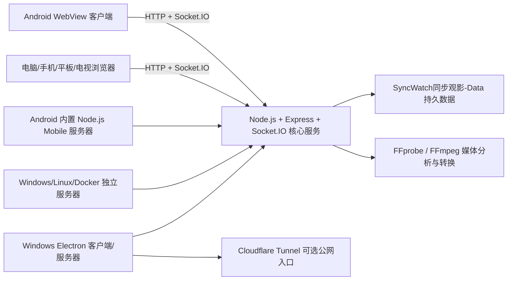
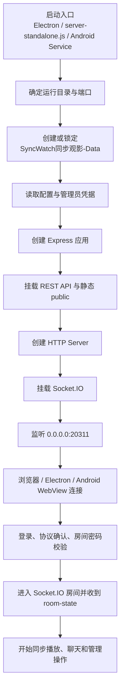
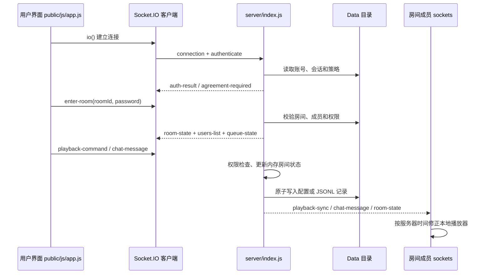
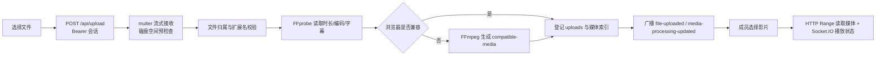
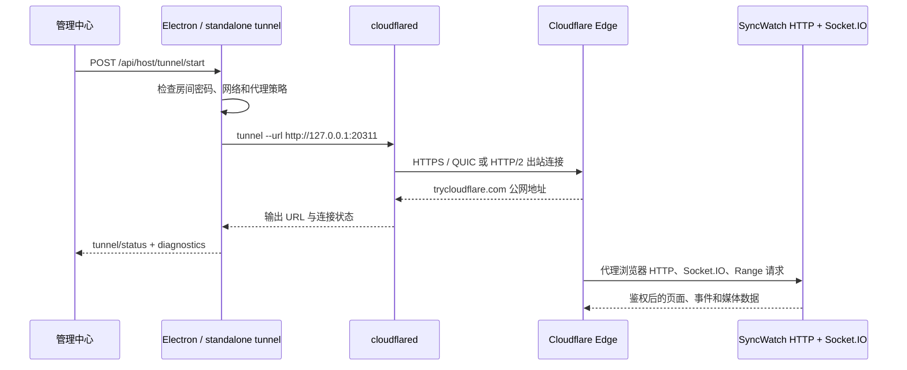

# SyncWatch同步观影 技术架构、模块与依赖说明

适用版本：v2.3.4 同版本纠正更新；新资产完成原子覆盖前，线上旧资产仍保持可下载
文档日期：2026-08-27

## 1. 项目定位

SyncWatch同步观影 是一套可离线部署的多人同步观影系统。Windows 桌面端同时承担图形客户端和服务器主机；独立服务器包可部署到 Windows Server、Linux x64 或 Docker；Android APK 既能作为客户端，也内置同一套 Node.js 服务端供手机热点或局域网使用。

项目没有使用 React、Vue、Angular 等前端框架。网页界面由原生 HTML、CSS、JavaScript 构成，通过 HTTP、REST 接口和 Socket.IO 与服务端通信。桌面端由 Electron 封装，Android 端由 Java WebView、Node.js Mobile 和原生桥接组成。

## 2. 总体架构



所有客户端共用 `public/` 下的同一套界面和业务代码，因此桌面浏览器、Electron、Android WebView、手机浏览器和平板浏览器的账号、房间、播放、聊天、通知和管理能力保持同步。平台特有能力通过 Electron 或 Android 原生桥接补充。

### 2.1 从启动到可用的执行流程

服务启动不是“打开一个网页”这么简单，而是依次完成运行环境、数据目录、HTTP 服务和实时通道的准备。下面的流程图对应实际入口和边界：



启动阶段失败会停在对应节点并返回明确错误：数据目录被另一进程占用时拒绝继续写入；端口占用时提示更换端口；Android 原生 Node 运行库缺失时不伪装成“服务器已启动”。

### 2.2 登录与实时同步调用链

网页端的登录表单通过 Socket.IO 发送认证事件，服务端校验账号、密码哈希、设备策略和房间权限后，再把会话绑定到 socket。HTTP 接口用于文件、备份和下载等请求；房间内的瞬时状态使用 Socket.IO 广播。



关键原则：

1. **服务器是房间状态的唯一事实来源。** 客户端只提交意图（播放、暂停、跳转、改倍速），不能直接覆盖其他成员的状态。
2. **每次状态广播都带时间和版本信息。** 客户端根据服务器时间、网络延迟和本地缓冲计算漂移，只有超过阈值才渐进校正，避免画面抖动。
3. **权限检查在服务端重复执行。** 页面隐藏按钮只是体验优化，真正的房主、管理员、成员和访客限制由 HTTP middleware 与 Socket handler 再次判断。
4. **写盘与广播分离。** 先更新受保护的房间内存状态，再按操作类型持久化；广播只发送脱敏后的公开字段，密码哈希、令牌和邮件授权码不会进入事件 payload。

### 2.3 媒体上传、处理与播放链路



大文件不会一次性读入内存；上传、转码和下载都使用流式处理。原文件、兼容文件、缩略图和字幕分开保存，删除或撤回时由服务端同时清理索引、任务和临时文件。

### 2.4 公网访问调用链



`cloudflared` 只负责网络入口，不保存账号、房间或影片。程序优先使用安装包中的已校验二进制，缺失时才按平台下载 Cloudflare 官方 Release 并校验 SHA-256；临时地址重启后可能变化。

代理后的客户端身份由 `server/index.js` 统一解析，HTTP 请求和 Socket.IO 握手共用同一算法。回环地址和服务器启动时采样的本机网卡地址默认可信，Docker/Nginx/frp 等额外代理使用 `SYNCWATCH_TRUSTED_PROXIES` 或 `--trusted-proxies` 声明精确 IP/CIDR，命令行值优先于环境变量。IPv4/IPv6 `/0` 会被当作无效条目忽略，不会开启全网段信任。`X-Forwarded-For` 从右向左剥离可信 hop，首个不可信地址才是客户端；直连 TCP 对端不可信时忽略全部转发头。`CF-Connecting-IP` / `X-Real-IP` 只作为可信单跳代理且没有有效 XFF 时的兼容回退。

## 3. 目录与模块职责

### 3.1 Windows Electron 桌面端

| 文件 | 职责 |
| --- | --- |
| `electron-pink.js` | Electron 主入口；启动内置服务器；创建主窗口、托盘和菜单；限制单实例；重复启动时聚焦旧窗口并提示；关闭窗口时让用户选择最小化到托盘、退出或取消；处理屏幕/窗口捕获；管理 Cloudflare Tunnel；生成服务器设置窗口；控制数据目录和安全退出。 |
| `electron-settings-preload.js` | 服务器设置窗口的最小化预加载桥，保持 `contextIsolation`，不向页面暴露 Node.js。 |
| `package.json` | Electron 入口、依赖锁定、测试命令和 `electron-builder` 便携 EXE 配置。 |
| `assets/app-icon.ico` | Windows EXE、窗口和托盘图标。 |

Electron 安全设置包括 `nodeIntegration: false`、`contextIsolation: true`、`sandbox: true`、同源导航限制和可信外链白名单。桌面端内置 Electron 自带的 Chromium 运行时，不依赖用户另外安装 Chrome；网页共享仍受目标网站的 `X-Frame-Options`、CSP、登录状态和版权保护限制。

### 3.2 服务端核心

| 文件 | 职责 |
| --- | --- |
| `server/index.js` | Express/HTTP 服务、Socket.IO 实时通道、可信代理链客户端 IP、账户认证、管理员、房间、权限、聊天、通知、媒体、队列、播放同步、屏幕共享、网页共享、文件上传、字幕、转码、回收站、操作历史、邮件验证码、安全策略和持久化。 |
| `server/ai-relay.js` | AI HTTPS 中转、接口路径规范化、DNS/内网地址拦截、重定向复核、超时与响应大小限制，以及 Responses/Chat Completions 返回解析。 |
| `server-standalone.js` | 独立服务器启动入口；读取端口和公网配置；生成并保存服务器主机令牌；定位 `SyncWatch同步观影-Data`；写入服务器运行信息；处理 SIGINT/SIGTERM 安全关闭。 |
| `start-server.cmd` / `.ps1` / `.sh` | Windows 和 Linux 的启动包装器。 |
| `Dockerfile` / `docker-compose.yml` | Linux x64 Docker 部署与数据目录挂载。 |

服务端使用 Node.js 内置的 `http`、`https`、`crypto`、`fs`、`net`、`dns`、`dgram`、`os`、`stream`、`async_hooks`、`child_process` 等模块完成网络、安全、文件、进程和流式处理。

### 3.3 网页前端

| 文件 | 职责 |
| --- | --- |
| `public/index.html` | 登录、注册、协议、主播放器、影片库、聊天、成员、管理中心、公告、网页共享、主题、房间切换等页面结构。 |
| `public/css/style.css` | 桌面、手机、平板、电视响应式布局；21 套界面风格；全屏、弹窗、管理页、公告和触控样式。 |
| `public/js/app.js` | 客户端状态机、登录注册、首次协议、房间、媒体、同步、聊天、权限、网页共享、上传/转换进度、通知、全屏旋转缩放、悬浮播放、Android 桥接和界面渲染。 |
| `public/js/network-quality-policy.js` | Socket.IO 控制通道质量分类、连续异常降级、连续健康恢复和房间状态文案；浏览器与服务端复用同一阈值策略。 |
| `public/js/ui-copy-runtime.js` | 扫描固定界面文案、生成不可解释的稳定 `ui.auto.*` key、排除运行数据并以安全文本方式应用覆盖。 |
| `public/js/avatar-tools.js` | 默认头像选择、头像大图预览、鼠标/触摸双击消歧，以及成员列表重绘后的单击目标恢复。 |
| `public/js/ai-workbench.js` | AI 对话、生图、视频任务轮询、模型读取、设备本地配置与对话导入导出。 |
| `public/css/ai-workbench.css` | AI 工作台在桌面、平板与手机端的主题化响应式布局。 |

前端不依赖外部 CDN，静态资源由本机服务器提供。Socket.IO 浏览器客户端由服务端同源提供，断网后会自动重连并恢复会话、房间、聊天和播放状态。

### 3.4 Android 客户端与手机服务器

| 文件 | 职责 |
| --- | --- |
| `mobile/app/src/main/java/.../MainActivity.java` | Android WebView 容器、服务器地址管理、文件选择、下载、麦克风、全屏、画中画、屏幕旋转、原生桥接和生命周期处理。 |
| `MobileServerService.java` | 在独立前台服务进程中运行内置 Node.js Mobile 服务端，使手机可作为局域网/热点服务器。 |
| `ScreenCaptureService.java` | Android 10 及以上 MediaProjection 屏幕采集、旋转适配、帧输出和安全停止。 |
| `native-node.cpp` | Java 与 Node.js Mobile 原生运行时之间的 JNI/C++ 桥。 |
| `AndroidManifest.xml` | 网络、前台服务、录音、通知、画中画和屏幕捕获声明。 |
| `mobile/app/build.gradle` | Android 编译、三 ABI、内置服务端资源、Node.js Mobile、NDK 桥接和发布签名规则。 |
| `mobile/build-apk.ps1` | 检查 SDK/JDK/Gradle/NDK/Node.js Mobile/签名密钥，离线构建并验证 APK。 |

Android APK 内嵌与桌面端相同的 `server/index.js`、`public/**` 和生产依赖。构建测试会逐字节验证 APK 中的服务端和网页资源是否与当前源码一致。

## 4. 核心业务模块

### 4.1 账户与认证

- 用户名、邮箱、SW 用户 ID、设备 ID、登录令牌和自动登录。
- 密码使用 PBKDF2 哈希保存，服务器和管理员不能查看用户原密码。
- 同一普通账号默认只允许一台设备在线；`admin` 默认可不限设备登录，也可由服务器修改策略。
- 每个账户默认可创建 1 个房间；服务器管理员可直接提高额度，用户也可提交房间额度申请。
- 同一注册 IP 默认限制重复注册；注册页常驻“申请一次注册名额”按钮，管理员可审批或把 IP 加入白名单。
- 注册申请包含 `requestedCount`，未处理申请可由同一设备按数量部分撤回或全部撤回；内置 `admin` 可单项或批量删除申请记录。批准、拒绝、撤回和删除均重新广播申请中心状态。
- 服务器设备登录页可直接选择“服务器超级管理员登录”，填写超级管理员账号和密码。
- 首次使用 `admin/admin888` 完成账号密码认证时，不再重复要求当前初始密码；服务端仅在该账号仍处于首次初始化时签发一次性跳过能力，同一弹窗直接填写新密码和确认密码，也可选择“暂不更改”进入。新密码仍执行至少 8 位和不可复用旧密码校验，设置成功后能力立即撤销；本机免密管理会话从不获得该能力。
- 密码有效期默认为 7 天，可设为 0 关闭；账户与服务器管理员哈希同步更新 `passwordChangedAt`。
- 账户管理响应只返回 `passwordStatus`（是否配置、待修改、过期和修改时间），不返回密码、`passwordHash` 或可逆凭据。管理员安全重置使用服务器配置的默认密码并撤销现有会话，前端只显示结果状态。
- 登录页的服务器设置入口允许使用超级管理员账号/密码建立会话，不依赖预先登录或本机令牌。
- 登录页的“超级管理员登录”建立管理专用会话后由前端直接打开管理中心服务器设置页；认证仍使用同一服务端权限和会话校验，但管理专用模式不切换到房间主界面、不触发房间进入动画或房间聊天/位置初始化，只有管理员主动选择房间入口时才进入观影。
- 首次登录必须阅读并接受服务器发布的使用协议；同一协议版本接受后无需重复确认。
- 成员头像单击继续打开成员资料，桌面双击或触摸端快速双击打开大图预览。单击动作延迟到双击判定窗口结束后执行；若期间成员状态更新重建 DOM，则根据账号重新找到当前头像控件，避免旧节点断开造成资料入口失效。

### 4.2 房间与权限

- 房间号、房间名称、房间密码、人数上限、所有者和创建额度；当前房主或超级管理员可原子修改房间号并迁移关联数据。
- 房主可管理本房间全部权限、成员、上传审核、媒体、聊天、播放、公告和解散。
- 房主可向来源房主申请复制房间配置、权限、队列和媒体文件；来源同意后创建独立副本。内置 `admin` 可二次确认后把来源内容覆盖迁移到既有目标，目标 ID 与所有者保持不变，文件复制失败时整笔回滚。
- 超级管理员/服务器设备可查看所有账户在线状态、设备、房间归属、房间媒体占用、额度申请和操作记录。
- 公网隧道开启前要求所有房间设置访问密码，运行期间禁止通过建房、清空密码或历史回溯绕过。
- 主界面提供明显的“解散当前房间”按钮；管理中心按钮位于顶栏最右侧。
- 新账号和普通密码默认使用 unrestricted 策略，只保留用户名 1024 UTF-8 字节、密码 4096 UTF-8 字节的防滥用上限；管理员可显式切换为更窄字符集和字符数范围。
- 账号密码认证的内置 `admin` 首次改密会由会话能力允许跳过重复当前密码校验；本机免密管理会话标记为未经过密码认证，不能复用该能力。
- `admin.uiCopy` 保存显式稳定 key 及固定界面控件自动生成的 `ui.auto.*` key；公开配置只返回归一化纯文本，服务端拒绝未知 key、HTML、脚本、选择器和 DOM 路径，并通过 `ui-copy-state` 向在线客户端广播更新。运行时扫描器排除影片名、账号/IP、Toast、动态对话正文等用户或会话数据；配置最多 5000 项、每项 240 个字符、导入 JSON 最大 2 MB，防止隐私内容混入可导出字典和异常配置滥用。

### 4.3 媒体与文件

- 单文件和文件夹上传、分块传输、上传中止、磁盘空间预检查和服务器端文件归属校验。
- FFprobe 读取编码、分辨率、时长、音轨和字幕信息。
- FFmpeg 生成缩略图、把不兼容视频转换为 H.264/yuv420p + AAC MP4，并把 SRT/ASS/SSA/GBK/GB18030 字幕转换为 VTT。
- 转换进度包括百分比、速度、已用时间和预计完成时间；删除文件会终止关联任务并清理临时文件。
- HTTP Range 支持浏览器拖动、断点和大文件分段读取；超过 32 MiB 的媒体把开放请求限制为每段 8 MiB，避免高延迟链路频繁续段，也避免拖动后遗留无限大响应。
- 默认共享清晰度为原画，用户可切换自动、流畅版和原画。

### 4.4 同步、共享与播放

- 播放、暂停、定位、音量、缓冲状态和版本号通过 Socket.IO 同步。
- 使用服务器时钟和网络延迟修正客户端时间，支持断线重连和晚加入恢复。
- 网络质量由独立的顺序 `network-ping` 探测判断，4 秒定时器不会与最长 5 秒的在途探测重叠；连续 3 次超过 500 毫秒或超时才从 `online` 降为 `unstable`，连续 2 次健康样本才恢复。页面进入后台后不发起探测，后台返回的旧 ACK 被丢弃，回前台重置状态并立即重新测量。探测带递增 sequence 和连接 epoch，服务端忽略乱序样本，客户端以 volatile 遥测避免重连后回放旧质量数据。HTMLMediaElement 的 `waiting/stalled` 只进入最多 5 次的渐进媒体恢复流程，离线等待不消耗预算，恢复用尽后可降级到已有流畅版；它不直接触发“网络波动”，本机 socket 断开单独显示“连接中断”。
- 文本/小说阅读使用独立的 `text-reading-update` 与 `text-reading-state` 事件。服务端保存当前文本 `fileId`、UTF-16 `characterOffset`、归一化位置、页码、更新时间、操作者和递增 `revision`，不把正文放进 Socket 消息；晚加入和重连客户端按 `room.textReading` 恢复。
- 只有房主或被授予控制权的成员可以更新阅读位置；切换/删除文本会重置状态。客户端忽略旧 revision，并始终保留服务端下发或页码计算出的精确逻辑 `characterOffset`。Range 只把该字符所在的本地视觉行滚动到顶部，窗口 resize 后重新校准；桌面与手机的视觉行首可以不同，但不得回写覆盖权威偏移，房间文件、revision、逻辑锚点和锚点字符必须一致。
- 屏幕共享支持 Electron 桌面捕获、浏览器能力和 Android MediaProjection。v2.3.4 纠正更新优先为每名观看者建立 WebRTC 音视频连接，连接成功后停止向该观看者转发 JPEG；进入 `disconnected` 时恢复有界 Socket.IO 兜底，轮询/Tunnel 根据 ACK 延迟在 960×540–1440×810 之间自适应 JPEG 尺寸、质量与采集节奏，持续断开后重建 Peer。桌面默认请求原生分辨率、检测到的设备刷新率（上限 240 FPS）、极致画质和系统音频，界面展示系统实际授予值。音频帧兜底采用 48 kHz、1024 帧、Int16 PCM 并兼容旧 Float32 数据；同一会话瞬断会迁移 `audioShare.socketId`，停止、断线超时或切房时才原子清空。共享 offer/answer 按共享者/观看者方向校验并限流。
- 网页 URL 共享由服务端校验 HTTP/HTTPS 地址并保存 `url`、标题、操作者、`updatedAt`/revision；晚加入和重连成员通过 `web-share-state` 恢复同一权威 URL。客户端在带 sandbox 的 iframe 中各自加载，Cookie、登录态、地域、CSP、X-Frame-Options、跨域脚本与页面自身状态不由服务器绕过，因此“同步网址”不等于跨域远程控制；需要像素和交互完全一致时使用浏览器标签页或窗口实时共享。
- 全屏状态支持横屏、竖屏和手机自动横屏切换、手动缩放、聊天、私聊、弹幕和公告。
- Electron、网页和 Android 支持悬浮播放；Android 使用系统画中画能力。

### 4.5 聊天、语音和通知

- 公聊、私聊、弹幕、图片、表情、语音消息和历史分页。
- 表情、消息和公告都显示发送者身份。
- 房主、超级管理员和服务器设备可发送全屏公告，可设置字体、颜色、字号、停留时间和发送范围。
- 私聊正文只允许通信双方读取；管理审计记录不会泄露私聊内容。

### 4.6 帮助入口与运行形态

- Web 顶栏“关于”和 Electron “帮助”菜单使用同一项目主页、Wiki、版本、许可证和作者信息；避免多个客户端维护不同的旧地址。
- Electron 服务器提供原生“系统 / 视图 / 帮助”菜单。纯 Node.js 服务端没有原生菜单，`node server-standalone.js --help` 输出参数边界，`--open-browser` 在服务就绪后打开带主机令牌的私密管理 URL；控制台摘要和 `SyncWatch同步观影-Data/服务器运行信息.txt` 同时记录管理 URL、配置和数据路径。浏览器中的刷新、全屏和缩放分别使用 F5、F11、Ctrl+0。

## 5. 数据存储

桌面端和独立服务器统一使用程序旁的 `SyncWatch同步观影-Data/`。主要内容如下：

| 路径 | 内容 |
| --- | --- |
| `config.json` | 账户哈希、房间、权限、媒体索引、队列、策略、联系信息、协议、管理员配置和操作历史。 |
| `chat-history.jsonl` | 按房间记录聊天和语音消息元数据。 |
| `uploads/` | 上传原文件。 |
| `thumbnails/` | 视频缩略图。 |
| `subtitles/` | 转换后的 WebVTT 字幕。 |
| `voice/` | 语音消息文件。 |
| `compatible/` | 自动生成的浏览器兼容视频。 |
| `trash/` | 支持恢复和操作回溯的临时回收数据。 |
| `.secrets/` | 邮件加密密钥和独立服务器主机令牌。 |
| `secrets/admin-password.json` | 独立的超级管理员密码哈希；删除整个 `secrets/` 后下次启动恢复 `admin/admin888` 初始流程。 |
| `.syncwatch-instance.lock/` | 阻止同一数据目录被多个实例同时写入。 |
| `服务器运行信息.txt` | 当前端口、访问地址、数据目录和私密主机入口。 |

数据写盘采用临时文件和原子替换策略；配置损坏、写盘失败或数据目录已被另一实例占用时会拒绝继续运行，避免静默覆盖数据。

## 6. 直接依赖与版本

桌面 EXE 自带 Electron/Node 运行时，不要求用户另装 Node.js。独立 Windows/Linux 服务器要求 Node.js 22 或更高版本，发布环境推荐 Node.js 24 LTS；Docker 使用 `node:24-bookworm-slim`。Android 内置服务器使用单独锁定的 Node.js Mobile 18.20.4，不与桌面/云服务器运行时混用。

### 6.1 生产依赖

| 包 | 版本 | 用途 |
| --- | --- | --- |
| `express` | 5.2.1 | HTTP 路由、静态资源和 REST 接口。 |
| `socket.io` | 4.8.3 | 实时房间、播放、聊天、通知和共享通道。 |
| `multer` | 2.2.0 | 文件和语音上传解析。 |
| `qrcode` | 1.5.4 | 房间地址二维码生成。 |
| `nodemailer` | 9.0.3 | QQ SMTP 测试邮件、验证码和密码找回。 |
| `ffmpeg-static` | 5.2.0 | Windows/Electron 内置 FFmpeg。 |
| `ffprobe-static` | 3.1.0 | Windows/Electron 内置 FFprobe。 |

### 6.2 开发、测试和打包依赖

| 包 | 版本 | 用途 |
| --- | --- | --- |
| `electron` | 41.10.3 | Windows 桌面运行时和内置 Chromium。 |
| `electron-builder` | 26.15.3 | Windows x64 便携 EXE 构建。 |
| `socket.io-client` | 4.8.3 | Node/Electron 集成与同步测试客户端。 |
| `ws` | 8.21.1 | WebSocket 安全与打包验收。 |
| `pnpm` | 11.9.0 | 锁定的包管理器版本。 |

为处理上游安全更新并保持协议兼容，项目通过 `overrides` 固定：`engine.io 6.6.9`、`socket.io-adapter 2.5.8`、`socket.io-parser 4.2.7`、`ws 8.21.1`。

### 6.3 用什么写、运行在哪里、调用什么

| 层次 | 实现技术 | 运行环境 | 主要调用/边界 |
| --- | --- | --- | --- |
| 页面与交互 | 原生 HTML、CSS、JavaScript、Web Components 风格的模块化函数 | Chromium、Firefox、Safari、Android WebView | `fetch` 调用 `/api/*`；`socket.io-client` 调用实时事件；WebRTC 用于语音/屏幕协商 |
| 服务端 | Node.js 22+、Express 5、Socket.IO 4 | Windows、Linux、Docker、Android Node.js Mobile | `http/https`、`fs`、`crypto`、`stream`、`child_process`、`dns`、`net` |
| 桌面容器 | Electron 41、electron-builder 26 | Windows x64 | `ipcMain/ipcRenderer`、`desktopCapturer`、托盘、窗口和系统权限 |
| Android 容器 | Java、C++ JNI、Android WebView、Node.js Mobile | Android 6.0+，arm64-v8a/armeabi-v7a/x86_64 | `MediaProjection`、前台服务、SAF 文件选择、JNI `nativeStartNode` |
| 媒体能力 | FFprobe、FFmpeg | 桌面完整包；轻量 Android 可能只提供原片 | `spawn` 子进程读取媒体元数据、转码、缩略图和字幕 |
| 公网入口 | Cloudflare `cloudflared` | Windows 二进制或 Linux 系统安装 | 本机 `127.0.0.1:20311` 到 Cloudflare Edge 的 HTTPS/QUIC/HTTP2 隧道 |
| 开发与交付 | npm/pnpm、PowerShell、Bash、Gradle、GitHub Actions | Windows 开发机与 GitHub-hosted runner | `npm ci`、构建脚本、发布契约测试、Pages 部署 |

项目没有调用第三方 CDN 来加载核心页面资源；生产网页、Socket.IO 客户端和播放器代码都由自己的服务端同源提供。可选 AI 工作台只在用户填写兼容的 HTTPS API 地址和密钥后由 `server/ai-relay.js` 代理，并阻止内网地址、重定向绕过和超大响应。

### 6.4 Android 工具链

| 组件 | 版本/要求 |
| --- | --- |
| Android Gradle Plugin | 8.11.1 |
| Gradle | 8.13 |
| Java | 17 或更高，推荐 Android Studio JBR |
| compileSdk / targetSdk | 35 |
| minSdk | 23 |
| Android Build Tools | 35.0.0 |
| Android NDK | 28.2.13676358 |
| Node.js Mobile | 18.20.4 |
| ABI | arm64-v8a、armeabi-v7a、x86_64 |

## 7. 构建方式

### 7.1 安装源码依赖

```powershell
npm ci
```

也可使用项目锁定的 pnpm：

```powershell
corepack enable
pnpm install --frozen-lockfile
```

### 7.2 运行开发版

```powershell
npm start
npm run start:server
```

### 7.3 生成 Windows EXE

推荐运行完整发布脚本：

```powershell
powershell -ExecutionPolicy Bypass -File .\build-windows.ps1
```

该脚本会先运行完整回归，再构建并验证签名 APK、Windows 体验客户端和完整便携版；所有正式成品直接写入根目录 `dist/`。

### 7.4 生成 Android APK

```powershell
powershell -NoProfile -ExecutionPolicy Bypass -File .\mobile\build-apk.ps1
```

发布 APK 必须使用原有 `mobile/.keys/` 签名身份。缺少密钥时构建会失败，不会使用调试证书代替。

### 7.5 生成独立服务器包

```powershell
powershell -NoProfile -ExecutionPolicy Bypass -File .\build-server-package.ps1
```

独立服务器 ZIP 是部署辅助包，由 `build-server-package.ps1` 默认生成到 `.build/server-deployment/`；它不属于正式 Release 的固定 8 项资产，也不会混入根目录 `dist/` 的 10 文件集合。

## 8. 测试体系

| 测试 | 覆盖内容 |
| --- | --- |
| `tests/integration.test.js` | 注册登录、房间、权限、文件、聊天、协议、管理和 HTTP 接口。 |
| `tests/features-1.0.0.test.js` | 版本功能、账户、同步、媒体和界面契约。 |
| `tests/server-hardening.test.js` | 并发、目录锁、Origin/Host、防绕过、隧道、回收、关闭和隐私。 |
| `tests/media.test.js` | 真实 FFprobe/FFmpeg、4K HEVC、10-bit H.264、字幕、缓存和 Range。 |
| `tests/electron-smoke.js` | Electron 渲染、管理、聊天、移动尺寸、协议和错误日志。 |
| `tests/sync-smoke.js` | 双窗口真实播放、时钟偏差、缓冲、断线恢复和共享帧。 |
| `tests/main-smoke.js` | 桌面主入口、托盘、端口、公网配置和屏幕捕获。 |
| `tests/tunnel-smoke.js` | Cloudflare Tunnel 生命周期和可用时的公网 WebSocket/Range/共享。 |
| `tests/text-reader.test.js` | 文本上传安全、字符锚点、权限、revision、删除重置和重连恢复。 |
| `tests/account-credential-policy.test.js` | 账号/密码默认 unrestricted、UTF-8 字节上限、可配置限制和持久化。 |
| `tests/ui-copy.test.js` | 文案权限、受控 key（含 `ui.auto.*`）、纯文本安全、广播、导入导出和持久化。 |
| `tests/ui-copy-browser-smoke.js` | 自动文案键稳定性、按钮覆盖率、动态隐私数据排除、双击编辑和桌面/390px 视口应用。 |
| `tests/network-quality.test.js` | 单次尖峰抑制、连续异常/健康迟滞、后台节流隔离、乱序忽略、真实断线语义，以及 40 MiB 媒体的 8 MiB 有界 Range 下控制通道响应。 |
| `tests/browser-ui-smoke.js` | 小说任意精确锚点的桌面/移动一致性、页码边界，以及头像单击/双击/触摸和列表重绘竞态。 |
| `tests/android-package.test.js` | APK 签名、ABI、依赖闭包和内置源码一致性。 |
| `tests/artifact-smoke.js` | 最终 EXE 启动、HTTP、WebSocket、上传播放和内置 APK。 |

## 9. 安全和合规设计

- 默认管理员密码只用于首次初始化，首次登录后强制设置新密码。
- 登录密码、SMTP 授权码和主机令牌不会以可直接读取的形式暴露给网页。
- 首次管理员免重复当前密码依赖服务端的一次性账号密码认证能力；本机免密会话、初始化完成后的会话和伪造客户端字段均不能获得或复用。
- 可导出的统一文案目录不扫描影片名、账号/IP、Toast 和动态对话正文；导入仍经过 key、纯文本、数量、长度和体积校验。
- 账号、房间、文件和 Socket 事件均校验会话及房间归属。
- 公网访问强制房间密码并限制 Origin、Host 和代理来源。
- 首次登录协议明确软件只可用于合法、已授权用途；用户违法、侵权或配置不当产生的责任由使用者承担。
- 文件、语音和操作回溯数据默认保留 30 天后清理；私聊审计不保存可被管理员读取的正文副本。
- 同一数据目录只允许一个服务实例写入；安全关闭会先拒绝新变更、等待在途上传，再保存状态。

## 10. 已知平台边界

- 网页能否内嵌显示由目标网站决定；禁止 iframe 的网站只能在外部/独立 Chromium 窗口打开。
- DRM、受保护窗口和部分系统声音不能被普通屏幕捕获接口共享。
- Android 内置服务器没有桌面 FFmpeg/FFprobe 时仍可提供原片，但无法生成兼容转码。
- Cloudflare Quick Tunnel 需要服务器能够访问 Cloudflare；受网络策略阻断时应改用固定反向代理、VPN 或其他合规内网穿透方案。
- iPhone/iPad 浏览器通常不能发起网页屏幕捕获，但可以观看共享画面和同步媒体。

## 11. 发布保留文件

源码交付至少应保留：

- `server/`、`public/`、`mobile/`、`tests/`、`scripts/`
- `electron-pink.js`、`electron-settings-preload.js`、`server-standalone.js`
- `package.json`、锁文件、Docker 和服务器启动/构建脚本
- `build-windows.ps1`、`build-server-package.ps1`
- `assets/app-icon.ico`
- 使用、部署和本技术说明文档
- 最终 EXE、APK、服务器 ZIP

`SyncWatch同步观影-Data/` 是运行数据，不属于空白源码发布包；重新发布前应删除真实账户、媒体、聊天、密钥、缓存和旧构建产物。


